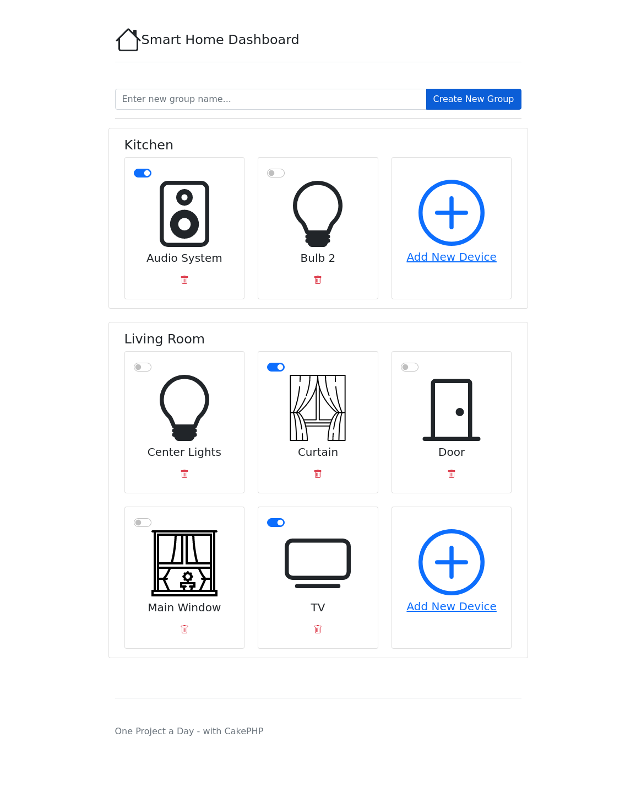
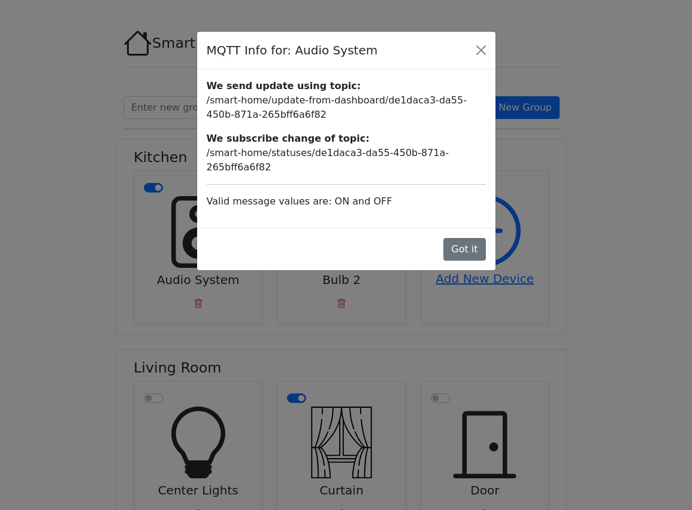

# One CakePHP project a day challenge - Day 14 Smart Home Dashboard with MQTT

On this project I'm using CakePHP 4, CakeDC/Users plugin, php-mqtt/client (testing with Mosquitto Broker) and Bootstrap 5.
The application is able to publish messages to change device status and subscribe for status changes.

## Steps to create this project

- 7505ea7 Init and boostrap setup
  ```
  composer create-project --prefer-dist cakephp/app
  ```
- 6ab0174 Added Base Models
  ```
  bin/cake bake migration CreateDeviceGroups name
  bin/cake bake migration CreateDevices id:uuid name type last_status device_group_id:integer  created  modified
  bin/cake migrations migrate
  bin/cake bake model DeviceGroups
  bin/cake bake model Devices
  ```
- 1c33371 Started dashboard with groups
- b7ed054 Added actions to manage devices
- f401b12 Display devices in the dashboard
- c9bb037 Update Device Status on Database
- 9374e07 Add php-mqtt client:
  ```
  composer require php-mqtt/client
  ```
- 03211b7 Publish message using MQTT when user change device status
- 3312e4e Added a command to simulate the smart home center device (raspberry pi)
- 2b87291 Added a command to subscribe to message from SmartHome Center
- c6224f8 Added Link to Delete Device
- e8de6f4 Fixed non inline images
- 9dc9b6e Added sample command to simulate SmartHome center publishing status
- 2541484 Added MQTT modal info for each device
- c10d28b Added Svg icon for delete button
- 88550ea Removed device id from cards, we already have info in the modal
- b943042 Improved header
- fad2c6e Added CakeDC/Users
  ```
  composer require cakedc/users
  cp vendor/cakedc/users/config/users.php config/
  cp vendor/cakedc/users/config/permissions.php config/
  cp vendor/cakedc/users/config/Migrations/* config/Migrations/
  bin/cake migrations migrate
  bin/cake users add_superuser
  ```

## Result




## Links
- https://github.com/cakedc/users
- https://github.com/php-mqtt/client
- https://hub.docker.com/_/eclipse-mosquitto
- https://icons.getbootstrap.com/
- https://mosquitto.org/
- https://www.svgrepo.com/
